# System Workflow — Step by Step

## 1. ภาพรวมวงจรคอนเทนต์

```mermaid
flowchart LR
    A[Channel Strategy] --> B[Idea Backlog]
    B --> C[Content Brief]
    C --> D[Script]
    D --> E[Storyboard and Scene Plan]
    E --> F[Generate Assets]
    F --> G[Assemble and Render]
    G --> H[Quality and Policy Gate]
    H --> I[Metadata and Thumbnail]
    I --> J[Publish Queue]
    J --> K[Published Video]
    K --> L[Analytics]
    L --> M[Insights and Experiments]
    M --> A
```



## 2. State Machine ของ Content Project

```text
IDEA
→ BRIEF_DRAFT
→ BRIEF_APPROVED
→ SCRIPT_DRAFT
→ SCRIPT_REVIEW
→ SCRIPT_APPROVED
→ STORYBOARD_DRAFT
→ ASSET_PRODUCTION
→ EDITING
→ QC_REVIEW
→ CHANGES_REQUESTED หรือ READY_TO_PUBLISH
→ SCHEDULED
→ PUBLISHED
→ ANALYZED
→ ARCHIVED
```

กฎสำคัญ

- ห้ามข้ามจาก `SCRIPT_DRAFT` ไป `ASSET_PRODUCTION` โดยไม่มี Script Approval
- ห้ามเผยแพร่จากสถานะอื่นนอกจาก `READY_TO_PUBLISH`
- เมื่อ Asset หรือ Script ที่อนุมัติแล้วเปลี่ยน ต้องเปิด Revision และทำ QC ใหม่
- การ Retry Generation Job ไม่เปลี่ยน Revision ของ Content Project จนกว่าจะเลือกผลลัพธ์มาใช้

---

# Phase 0 — Project Foundation

## Step 0.1 กำหนด Workspace

ข้อมูลขั้นต่ำ

- ชื่อ Workspace
- Owner
- ภาษาเริ่มต้น
- Timezone: `Asia/Bangkok`
- ค่าเงินสำหรับ Cost Tracking
- Storage Policy
- Default Approval Rules

**ผลลัพธ์:** Workspace พร้อมใช้งานและมี Audit Log เริ่มต้น

## Step 0.2 สร้าง Channel Profile

ข้อมูล

- ชื่อช่องและ Handle
- กลุ่มผู้ชม
- ภาษาหลัก
- Content Pillars
- รูปแบบวิดีโอ
- ความยาวเป้าหมาย
- Tone of Voice
- Visual Style
- Publishing Cadence
- ข้อห้ามเฉพาะช่อง

**Gate 0:** Channel Profile ต้องผ่านการอนุมัติก่อนสร้าง Content Project

---

# Phase 1 — Strategy and Planning

## Step 1.1 สร้าง Audience Profile

ระบุ

- ช่วงวัย
- ผู้ชมหลักและผู้มีอิทธิพลต่อการรับชม เช่น ผู้ปกครองหรือครู
- ความสนใจ
- ปัญหาและแรงจูงใจ
- ภาษาที่เหมาะสม
- สิ่งที่ควรหลีกเลี่ยง

## Step 1.2 กำหนด Content Pillar

ตัวอย่าง Pillar

- นิทานคุณธรรม
- การผจญภัยและการแก้ปัญหา
- เพลงช่วยจำ
- การ์ตูนตลกสั้น
- Quiz หรือ Mini Challenge

แต่ละ Pillar ต้องมี

- Objective
- Audience
- Format
- Hook Pattern
- Episode Pattern
- CTA Pattern
- KPI
- Risk Notes

## Step 1.3 สร้าง Content Calendar

ระบบต้องรองรับ

- Backlog
- Planned
- In Production
- Ready
- Scheduled
- Published
- Repurpose Candidate

**Gate 1 — Strategy Approval**

- Audience ชัดเจน
- Pillar ไม่ซ้ำซ้อนเกินจำเป็น
- รูปแบบวิดีโอสัมพันธ์กับทรัพยากร
- มี KPI ที่วัดได้

---

# Phase 2 — Idea to Content Brief

## Step 2.1 บันทึก Idea

แหล่ง Idea

- ผู้ใช้ป้อนเอง
- สรุปจาก Research Note
- แตกไอเดียจาก Pillar
- Repurpose จากวิดีโอเดิม
- สร้าง Variation จาก Template

ฟิลด์สำคัญ

- Idea Title
- One-line Concept
- Channel
- Pillar
- Format
- Target Audience
- Source/Reference
- Originality Note
- Estimated Effort
- Priority

## Step 2.2 ให้คะแนน Idea

เกณฑ์แนะนำ 1–5

- Audience Fit
- Originality
- Production Feasibility
- Reusability
- Series Potential
- Educational/Entertainment Value
- Risk Level

## Step 2.3 สร้าง Content Brief

Content Brief ต้องมี

- Objective
- Core Message
- Hook
- Audience Promise
- Story/Content Structure
- Character
- Visual Direction
- Audio Direction
- Duration
- CTA
- Deliverables
- Constraints
- Success Metric

**Gate 2 — Brief Approval**

Acceptance Criteria

- แนวคิดอธิบายได้ในหนึ่งประโยค
- Audience และผลลัพธ์ผู้ชมชัดเจน
- ไม่มีความขัดแย้งกับ Brand/Character Bible
- ระบุความยาวและรูปแบบวิดีโอแล้ว

---

# Phase 3 — Script and Story Design

## Step 3.1 สร้าง Script Version 1

ระบบเลือก Template ตาม Format

### นิทานเด็ก

```text
Hook → Setup → Problem → Attempts → Turning Point → Resolution → Lesson → Gentle CTA
```

### การ์ตูนสั้น

```text
Visual Hook → Conflict → Escalation → Twist/Payoff → Loop or CTA
```

### เพลงเด็ก/เพลงช่วยจำ

```text
Intro → Verse → Chorus → Verse → Chorus → Bridge → Final Chorus → Outro
```

### Shorts

```text
0–2s Hook → 2–10s Context → 10–35s Main Action → 35–50s Payoff → 50–60s CTA/Loop
```

## Step 3.2 ตรวจ Script

ตรวจอย่างน้อย

- ความเหมาะสมกับวัย
- ความชัดเจนของภาษา
- Pacing
- Character Consistency
- Scene Feasibility
- คำหรือเนื้อหาที่มีความเสี่ยง
- ความคล้ายกับแหล่งอ้างอิง
- จำนวนคำสัมพันธ์กับระยะเวลา
- CTA ไม่รบกวนประสบการณ์เด็ก

## Step 3.3 จัดการ Revision

- ทุก Revision มีเลขเวอร์ชัน
- เก็บ Diff หรือ Change Summary
- ระบุผู้แก้และเหตุผล
- Approval ผูกกับ Version

**Gate 3 — Script Approval**

ห้ามสร้าง Asset Production หลักก่อนผ่าน Gate นี้

---

# Phase 4 — Storyboard and Production Plan

## Step 4.1 แปลง Script เป็น Scene

แต่ละ Scene มี

- Scene Number
- Duration
- Narration/Dialogue
- Visual Description
- Character and Pose
- Background
- Camera/Composition
- Motion
- Sound Effect
- Music Cue
- On-screen Text
- Transition
- Asset Dependencies

## Step 4.2 สร้าง Shot List

รองรับ

- Establishing
- Medium
- Close-up
- Detail
- Reaction
- Insert
- Loop Shot

## Step 4.3 สร้าง Prompt Pack

Prompt Pack แยกตามประเภท

- Image Prompt
- Character Consistency Prompt
- Background Prompt
- Motion/Video Prompt
- Voice Direction
- Music Direction
- Sound Effect List
- Thumbnail Prompt

**Gate 4 — Production Plan Approval**

- Scene ครบตาม Script
- Duration รวมอยู่ในช่วงเป้าหมาย
- Asset Dependency ครบ
- ไม่มี Scene ที่ผลิตไม่ได้ด้วยเครื่องมือที่เลือก

---

# Phase 5 — Asset Generation and Library

## Step 5.1 ตรวจ Asset ที่ใช้ซ้ำได้ก่อนสร้างใหม่

ค้นจาก

- Character Asset
- Background
- Prop
- Voice
- Music
- Sound Effect
- Logo/Intro/Outro
- Caption Style

## Step 5.2 สร้าง Generation Job

Generation Job ต้องมี

- Provider
- Model/Engine Identifier
- Prompt Version
- Input Assets
- Parameters
- Estimated Cost
- Status
- Retry Count
- Output
- Safety Result
- Error
- Created By

## Step 5.3 Review และเลือก Asset

สถานะ Asset

- Generated
- Shortlisted
- Approved
- Rejected
- Needs Edit
- Deprecated

## Step 5.4 บันทึก Provenance และสิทธิ์

อย่างน้อย

- Source Type
- Provider
- Created Date
- License/Usage Note
- Prompt Reference
- Parent Asset
- Human Edits
- Allowed Channels

**Gate 5 — Asset Approval**

- ตัวละครและสไตล์สม่ำเสมอ
- ไม่มีข้อมูลหรือเครื่องหมายที่ไม่ควรอยู่ในภาพ
- ไฟล์มีขนาดและรูปแบบถูกต้อง
- สิทธิ์การใช้งานถูกบันทึก

---

# Phase 6 — Assembly and Render

## Step 6.1 สร้าง Timeline

Timeline ประกอบด้วย

- Video Track
- Image/Animation Track
- Narration
- Dialogue
- Music
- SFX
- Caption
- Overlay
- Transition

## Step 6.2 Validation ก่อน Render

- ไม่มี Missing Asset
- Duration ตรงตาม Scene Plan
- Audio Level อยู่ในช่วงกำหนดของโปรเจ็ก
- Caption มี Text ครบ
- Aspect Ratio ตรงกับ Format
- Safe Area ผ่าน

## Step 6.3 Render Job

สถานะ

- Queued
- Running
- Succeeded
- Failed
- Cancelled
- Needs Review

ต้องรองรับ Retry และ Idempotency เพื่อป้องกัน Render ซ้ำโดยไม่ตั้งใจ

---

# Phase 7 — Quality, Safety and Publish Readiness

## Step 7.1 Content QC

- Story Continuity
- Character Continuity
- Pronunciation
- Caption Accuracy
- Visual Defect
- Audio Defect
- Pacing
- Thumbnail/Title Alignment
- Duplicate or Reused Segment Review

## Step 7.2 Child-content Review

Checklist ต้องกำหนดแก้ไขได้และบันทึกเวอร์ชัน เนื่องจากกฎแพลตฟอร์มอาจเปลี่ยน

- ภาษาและภาพเหมาะสมกับวัยเป้าหมาย
- ไม่มีการชักจูงที่ไม่เหมาะสม
- ไม่มีสถานการณ์อันตรายที่เลียนแบบได้โดยไม่มีบริบท
- ไม่มีข้อมูลส่วนบุคคลเด็ก
- ไม่มีเสียง ภาพ หรือเนื้อหาที่ทำให้เข้าใจผิด
- เพลงและเสียงมีสิทธิ์ใช้งาน

## Step 7.3 Copyright and Provenance Review

- Asset ทุกชิ้นมี Source
- Reference ใช้เพื่อแรงบันดาลใจ ไม่คัดลอกเนื้อหา
- เพลง เนื้อร้อง Voice และภาพมี Usage Note
- ตรวจ Logo/Trademark และข้อความที่ไม่เกี่ยวข้อง

## Step 7.4 Technical QC

- Resolution
- Frame Rate
- Aspect Ratio
- Audio Sync
- Caption Timing
- Thumbnail Size
- File Integrity

**Gate 6 — Publish Readiness**

ต้องไม่มี Critical/High ที่ยังไม่แก้ และ Reviewer ต้องอนุมัติ Version สุดท้าย

---

# Phase 8 — Metadata and Publishing

## Step 8.1 สร้าง Metadata Package

- Title Variants
- Description
- Keywords/Tags
- Playlist
- Chapters สำหรับวิดีโอยาว
- Thumbnail Variants
- Audience Setting Note
- Disclosure/Attribution Note ตามความจำเป็น
- Scheduled Date/Time

## Step 8.2 Publish Queue

MVP รองรับ Export Package ก่อน จากนั้นค่อยเพิ่ม YouTube Integration

สถานะ

- Ready
- Scheduled
- Uploading
- Processing
- Published
- Failed
- Requires Manual Action

## Step 8.3 ยืนยันหลังเผยแพร่

- Video ID/URL
- Published At
- Actual Metadata
- Thumbnail Version
- Playlist
- Error/Warning

---

# Phase 9 — Analytics and Learning Loop

## Step 9.1 นำเข้าข้อมูลผลลัพธ์

- Views
- Impressions
- CTR
- Watch Time
- Average View Duration
- Retention Points
- Likes/Comments/Shares ตามที่ระบบได้รับ
- Subscribers Gained
- Revenue Data เมื่อผู้ใช้เชื่อมและมีสิทธิ์

## Step 9.2 วิเคราะห์ตามมิติ

- Channel
- Pillar
- Format
- Character
- Hook
- Duration
- Thumbnail Variant
- Title Pattern
- Publish Time
- Production Cost

## Step 9.3 สร้าง Insight

ตัวอย่าง

- Hook แบบใดรักษาผู้ชมช่วง 3–10 วินาทีได้ดี
- Character ใดสร้าง Returning Viewer สูง
- วิดีโอรูปแบบใดใช้ต้นทุนน้อยแต่ Completion สูง
- Scene ใดมี Retention Drop ซ้ำ

## Step 9.4 สร้าง Experiment

- เปลี่ยน Hook
- เปลี่ยน Thumbnail
- เปลี่ยน Duration
- เปลี่ยน Episode Pattern
- เปลี่ยน CTA
- Repurpose Long-form → Shorts

**Gate 7 — Learning Review**

ทุกเดือนหรือทุกชุดวิดีโอ ให้ปรับ Template/Strategy จากหลักฐาน ไม่ใช่ความรู้สึกเพียงอย่างเดียว

---

# Phase 10 — Operations and Reliability

## Step 10.1 Cost Control

- Budget ต่อ Workspace/Channel/Project
- Cost Estimate ก่อน Generation
- Alert เมื่อเกิน Threshold
- Cost per Approved Asset
- Cost per Published Video

## Step 10.2 Failure Recovery

- Retry แบบ Backoff
- Idempotency Key
- Job Timeout
- Dead-letter/Failed Queue
- Manual Retry
- Provider Fallback แบบต้องได้รับอนุมัติเมื่ออาจเพิ่มต้นทุน

## Step 10.3 Audit and Security

บันทึก

- Login
- Role Change
- Provider Configuration
- Prompt Change
- Asset Approval
- QC Approval
- Publish Action
- Secret Rotation โดยไม่บันทึกค่าจริง

## Step 10.4 Backup

- Database Backup
- Metadata Export
- Asset Storage Backup
- Restore Drill
- Retention Policy
