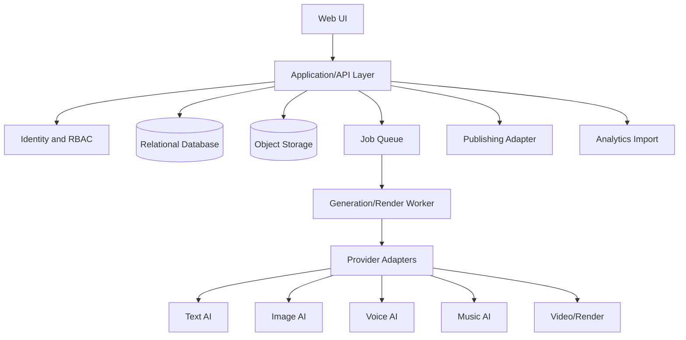

# Architecture and Data Design

## 1. ทางเลือกสถาปัตยกรรม

### Option A — Automation-first

ใช้เครื่องมือ Automation เชื่อมหลายบริการและเก็บข้อมูลใน Spreadsheet/Database

**ข้อดี:** เริ่มเร็ว เห็นผลเร็ว  
**ข้อจำกัด:** Workflow ซับซ้อนเมื่อมี Version, Approval, Retry และหลายช่อง

### Option B — Modular Web Application + Background Jobs — แนะนำ

Web App เป็น Source of Truth แยก Provider Adapter และ Job Worker

**ข้อดี:** ควบคุม State, Version, Permission, Cost และ Audit ได้ดี ขยายทีละโมดูลได้  
**ข้อจำกัด:** ต้องลงทุนพัฒนา Foundation และ Test

### Option C — Microservices

แยกบริการ Script, Asset, Render, Publish, Analytics

**ข้อดี:** Isolation และ Scale รายบริการ  
**ข้อจำกัด:** ซับซ้อนเกินจำเป็นสำหรับทีมเล็กและ MVP

## 2. Architecture ที่เลือก

เลือก **Option B: Modular Monolith + Asynchronous Job Boundary**



### Baseline Stack ที่เสนอ

- Frontend/Application: TypeScript Web Application แบบ Server-rendered หรือ Full-stack
- Database: PostgreSQL-compatible relational database
- Storage: S3-compatible หรือ Managed Object Storage
- Authentication: Managed Auth หรือ Auth Library ที่รองรับ Server-side Session
- Queue/Worker: Job Queue ที่รองรับ Retry และ Idempotency
- Hosting: Managed Web Hosting + Worker Runtime
- Testing: Unit, Integration และ E2E

> ไม่ผูกชื่อ Provider ไว้ใน Domain Layer ให้ระบุผ่าน Adapter และ Configuration

## 3. Layering

```text
UI / Presentation
↓
Application Use Cases
↓
Domain Model and Policies
↓
Repository Interfaces / Provider Interfaces
↓
Database, Storage, Queue, External APIs
```

กฎ Dependency

- UI ห้ามเรียก Provider SDK โดยตรง
- Domain ห้าม import Framework/Database Client
- Provider Adapter แปลง Error เป็น Error Type กลาง
- State Transition ผ่าน Domain Policy เท่านั้น
- Export อ่านจาก Version ที่ Approved ไม่อ่าน Draft ล่าสุดโดยอัตโนมัติ

## 4. Module Boundary

```text
identity
workspace
channel
character
idea
content-project
script
storyboard
prompt-library
asset
generation
render
quality
publishing
analytics
settings
audit
```

แต่ละ Module มี

- `domain/`
- `application/`
- `infrastructure/`
- `ui/` หรือ Route ที่เกี่ยวข้อง
- `tests/`

## 5. Data Model หลัก

| Entity | หน้าที่ |
|---|---|
| users | ผู้ใช้ |
| workspaces | พื้นที่ทำงาน |
| workspace_members | สมาชิกและ Role |
| channels | โปรไฟล์ช่อง |
| audiences | กลุ่มผู้ชม |
| content_pillars | เสาหลักเนื้อหา |
| brand_profiles | โทน ภาษา ภาพ และ Rule |
| characters | ตัวละคร |
| character_versions | Character Bible แต่ละรุ่น |
| ideas | Idea Backlog |
| content_projects | หน่วยงานผลิตวิดีโอ |
| project_revisions | Revision ระดับโปรเจ็ก |
| briefs | Content Brief |
| scripts | Script Version |
| script_sections | ส่วนของ Script |
| scenes | Scene Plan |
| shots | Shot List |
| prompt_templates | Prompt Template |
| prompt_template_versions | รุ่นของ Template |
| prompt_runs | Prompt ที่ถูก Render แล้ว |
| assets | ไฟล์/ลิงก์ Asset |
| asset_relations | Parent/Derivative/Reference |
| generation_jobs | Job สร้าง Asset |
| generation_outputs | ผลลัพธ์หลายตัวเลือก |
| render_jobs | Job ประกอบ/Render |
| qc_templates | Checklist Template |
| qc_template_versions | Version Checklist |
| qc_runs | การตรวจแต่ละครั้ง |
| qc_findings | Finding และ Evidence |
| approvals | การอนุมัติผูก Entity/Version |
| metadata_packages | Title/Description/Thumbnail |
| publish_jobs | Queue และผลเผยแพร่ |
| published_videos | Video ID/URL/Version |
| metrics_daily | Metric รายวัน |
| experiments | การทดลอง |
| costs | Estimate/Actual Cost |
| audit_logs | ประวัติ Action |

## 6. Key Constraints

- `workspace_members(workspace_id, user_id)` unique
- `channels(workspace_id, slug)` unique
- Script Approval ต้องอ้าง `script_version_id`
- Content Project มี `current_state` และ `state_version` สำหรับ Optimistic Concurrency
- Generation Job มี `idempotency_key` unique ภายใน Workspace/Provider
- Asset ที่ถูกใช้ใน Approved Revision ห้าม Hard Delete
- QC Gate Decision ต้องอ้าง `qc_run_id` และ `project_revision_id`
- Published Video ต้องอ้าง Metadata/Render/Project Version ที่ใช้จริง

## 7. State Transition Policy

ตัวอย่าง Server-side Policy

```text
IDEA -> BRIEF_DRAFT
BRIEF_DRAFT -> BRIEF_APPROVED
BRIEF_APPROVED -> SCRIPT_DRAFT
SCRIPT_DRAFT -> SCRIPT_REVIEW
SCRIPT_REVIEW -> SCRIPT_APPROVED | CHANGES_REQUESTED
SCRIPT_APPROVED -> STORYBOARD_DRAFT
STORYBOARD_DRAFT -> ASSET_PRODUCTION
ASSET_PRODUCTION -> EDITING
EDITING -> QC_REVIEW
QC_REVIEW -> CHANGES_REQUESTED | READY_TO_PUBLISH
READY_TO_PUBLISH -> SCHEDULED | PUBLISHED
SCHEDULED -> PUBLISHED | FAILED
PUBLISHED -> ANALYZED
ANY_NON_PUBLISHED -> ARCHIVED ตามสิทธิ์
```

ทุก Transition ต้องตรวจ

- Role
- Required Fields
- Approval Version
- Blocking QC Findings
- Concurrency Version
- Audit Context

## 8. Provider Adapter Contract

```ts
interface GenerationProvider<TInput, TOutput> {
  providerId: string;
  validateInput(input: TInput): Promise<ValidationResult>;
  estimateCost(input: TInput): Promise<CostEstimate | null>;
  submit(input: TInput, context: JobContext): Promise<ProviderJobRef>;
  poll(ref: ProviderJobRef): Promise<ProviderJobStatus<TOutput>>;
  cancel?(ref: ProviderJobRef): Promise<void>;
  normalizeError(error: unknown): ProviderError;
}
```

Error Type กลาง

- `INVALID_INPUT`
- `AUTHENTICATION_FAILED`
- `RATE_LIMITED`
- `TIMEOUT`
- `SAFETY_REJECTED`
- `PROVIDER_UNAVAILABLE`
- `INSUFFICIENT_QUOTA`
- `UNKNOWN_PROVIDER_ERROR`

## 9. API Design Principles

- Version API ที่ Public หรือมี Client หลายรุ่น
- Validate Request ฝั่ง Server
- Authorization ทุก Resource ด้วย Workspace Scope
- ใช้ Cursor Pagination กับรายการใหญ่
- ใช้ Idempotency Key กับ Create Job/Publish
- Error Response มี Code, Message, Correlation ID และ Field Errors
- ห้ามส่ง Stack Trace หรือ Provider Secret ไป Client

ตัวอย่าง Endpoint กลุ่มหลัก

```text
POST   /api/workspaces
GET    /api/workspaces/:workspaceId/channels
POST   /api/channels/:channelId/ideas
POST   /api/ideas/:ideaId/convert-to-project
POST   /api/projects/:projectId/transition
POST   /api/projects/:projectId/scripts
POST   /api/scripts/:scriptVersionId/approve
POST   /api/projects/:projectId/scenes/generate-draft
POST   /api/generation-jobs
POST   /api/generation-jobs/:jobId/retry
POST   /api/projects/:projectId/qc-runs
POST   /api/projects/:projectId/export
POST   /api/projects/:projectId/publish-jobs
GET    /api/analytics/overview
```

## 10. Security

- RBAC + Resource Ownership ฝั่ง Server
- CSRF/Session Protection ตาม Framework
- File Type/Size Validation
- Signed URL สำหรับ Asset
- Secret แยก Server-only
- Webhook Signature Verification
- Rate Limit ต่อ User/Workspace/Endpoint
- Redaction Log
- Audit Log แบบ Append-oriented
- Backup และ Restore Test

## 11. Observability

ทุก Request/Job มี

- Correlation ID
- Workspace ID แบบไม่เปิดเผยข้อมูลเกินจำเป็น
- Module
- Action
- Duration
- Result
- Error Code
- Retry Count
- Provider ID
- Cost Estimate/Actual เมื่อมี

Dashboard Operations

- Job Success Rate
- Job Queue Age
- Provider Error Rate
- Render Failure
- Publish Failure
- Cost Threshold
- Storage Usage

## 12. Export Package

```text
project-export.zip
├─ manifest.json
├─ project-summary.md
├─ brief.md
├─ script.md
├─ scenes.csv
├─ prompts/
│  ├─ scene-001-image.txt
│  ├─ scene-001-motion.txt
│  └─ ...
├─ assets.json
├─ qc-report.md
├─ metadata.md
└─ provenance.json
```

Export ต้องมี Schema Version เพื่อรองรับการนำกลับเข้าระบบในอนาคต
